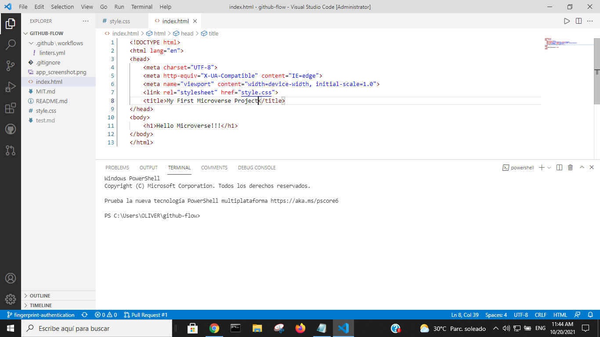

# Fingerprint Authentication

> This project is about reading the fingerprint.

Additional description about the project and its features.

## Built With

- Major languages
- Frameworks
- High technologies

## Authors

👤 **Author**

- GitHub: [@oliverSCZ](https://github.com/oliverSCZ)

## 🤝 Contributing

Contributions, issues, and feature requests are welcome!

Feel free to check the [issues page](../../issues/).

## Show your support

Give a ⭐️ if you like this project!

## Acknowledgments

- Hat tip to anyone whose code was used
- Inspiration
- etc

## 📝 License

This project is [MIT](./MIT.md) licensed.
